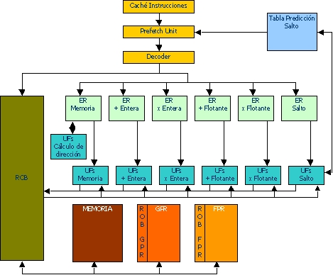

### Características

1. Control de la máquina basado en el algoritmo de Tomasulo

2. El parámetro más importante de esta máquina es el Grado de Emisión (nos referiremos a este parámetro simplemente como Emisión a partir de ahora), que es el número máximo de instrucciones que pueden emitirse por ciclo, pero también el número máximo de instrucciones que pueden graduarse (commit) por ciclo.

3. Emplea predicción dinámica de saltos.

### Componentes

* **Prefetch**: Unidad de prebúsqueda de instrucciones.

* **Decoder**: Decodificador de las instrucciones

* **ROB<->GPR**: Posición del ROB donde se está procesando un registro de propósito general

* **ROB<->FPR**: Posición del ROB donde se está procesando un registro de punto flotante

* **Predicción Salto**: Tabla de predicción de salto

* **ROB**: Reorder Buffer

* **E.R.**: Estaciones de Reserva

* **U.F.**: Unidades Funcionales

* **ALU de cálculo de direcciones: Unidad para calcular las direcciones de las instrucciones de memoria

{bmc bm41.BMP}

### Characteristics

1. Control of the processor based on Tomasulo's algorithm.

2. The Issue Rate is the most important parameter for this processor. The Issue Rate is the maximum number of instructions issued per cycle (and consequently the maximum number of instructions that may commit per cycle).

3. It uses dynamic branch prediction.

### Components

* **Prefetch**: Prefetch unit.

* **Decoder**: Decoder Unit

* **ROB<->GPR**: ROB entry where a General Purpose Register is being processed.  

* **ROB<->FPR**: ROB entry where a Floating Point Register is being processed. 

* **Branch Prediction**: 2-bit Branch Prediction Table. 

* **ROB**: Reorder Buffer. 

* **RE**: Reservation Stations. 

* **FU**: Functional Units. 

* **Address computing ALU**: This unit computes memory addresses.